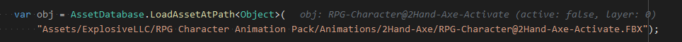
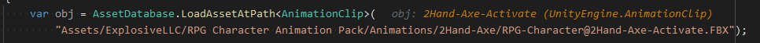
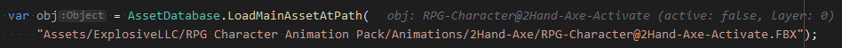

[AssetDatabase]
==

大部分文件格式是经过存储优化的, 但是在游戏里资源需要以合适的形式被硬件使用  
例如 png 文件会被转换成合适的文件 (imported data) 储存在项目的 `Library` 中, Texture 类会使用这个版本的数据, Unity 会把它上传给 GPU  

[AssetDatabaseRefreshing]  
当修改了已经导入的源文件(或源文件的依赖)时, Unity 会重新导入这个文件, 并且更新对应的 imported data  

[AssetDatabase] API 可以 access Assets, 控制和自定义导入处理  

## Asset Import Dependencies  
AssetDataBase 记录每个资源的所有依赖  
依赖包括所有所有会影响 imported data 的东西  
比如源文件, 资源导入设置, 目标平台等  
当更改了任何依赖, imported data 会变成不可用并重新导入  

## Asset caching  
imported data 默认在本地的 `Library` 中, [版本控制不应该包含这个目录][ExternalVersionControlSystemSupport]  
可以使用 [Unity Accelerator] 来通过网络共享缓存文件  

## Source Assets and Artifacts  
AssetDataBase 由两部分组成  
* The Source Asset Database  
* The Artifact Database  

The Source Asset Database 在 `Library\SourceAssetDB` 里, 包括:  
* 最后修改时间  
* 文件内容 hash  
* GUID 等  

The Artifact Database 在 `Library\ArtifactDB` 里  
Artifacts are the results of the import process  
The Artifact database contains information about the import results of each source asset  
Each Artifact contains the import dependency information, Artifact meta-information and a list of Artifact files  

## Importing an Asset  
当把资源拖入 Project 时, Unity 会自动导入. 也可以通过 [AssetDatabase.ImportAsset] 手动导入

## Loading an Asset  
Unity 在必要的时候自动加载 assets, 比如资源被加入到 scene, 在 Inspector 里编辑等  
用脚本加载:  
* [AssetDatabase.LoadAssetAtPath]  
* [AssetDatabase.LoadMainAssetAtPath]  
* [AssetDatabase.LoadAllAssetRepresentationsAtPath]  
* [AssetDatabase.LoadAllAssetsAtPath]  

脚本加载时会触发:  
* [AssetModificationProcessor.OnWillSaveAssets]  
* [AssetPostProcessor.OnPostProcessAllAssets]  

### [AssetDatabase.LoadAssetAtPath]  
返回这个路径下的第一个资源, 忽略 Project view 下不可见的

根据传入的类型不同返回不同的结果  
忽略大小写  
All asset names and paths in Unity use forward slashes, even on Windows  
  
  

### [AssetDatabase.LoadMainAssetAtPath]  
只会返回最外层的资源  
  

### [AssetDatabase.LoadAllAssetRepresentationsAtPath]  

[AssetDatabase]:https://docs.unity.cn/2021.3/Documentation/Manual/AssetDatabase.html  
[AssetDatabaseRefreshing]:AssetDatabaseRefreshing.md  
[ExternalVersionControlSystemSupport]:https://docs.unity.cn/2021.3/Documentation/Manual/ExternalVersionControlSystemSupport.html  
[Unity Accelerator]:https://docs.unity.cn/2021.3/Documentation/Manual/UnityAccelerator.html  
[AssetDatabase.ImportAsset]:https://docs.unity.cn/2021.3/Documentation/ScriptReference/AssetDatabase.ImportAsset.html  
[AssetDatabase.LoadAssetAtPath]:https://docs.unity.cn/2021.3/Documentation/ScriptReference/AssetDatabase.LoadAssetAtPath.html  
[AssetDatabase.LoadMainAssetAtPath]:https://docs.unity.cn/2021.3/Documentation/ScriptReference/AssetDatabase.LoadMainAssetAtPath.html  
[AssetDatabase.LoadAllAssetRepresentationsAtPath]:https://docs.unity.cn/2021.3/Documentation/ScriptReference/AssetDatabase.LoadAllAssetRepresentationsAtPath.html  
[AssetDatabase.LoadAllAssetsAtPath]:https://docs.unity.cn/2021.3/Documentation/ScriptReference/AssetDatabase.LoadAllAssetsAtPath.html  
[AssetModificationProcessor.OnWillSaveAssets]:https://docs.unity.cn/2021.3/Documentation/ScriptReference/AssetModificationProcessor.OnWillSaveAssets.html  
[AssetPostProcessor.OnPostProcessAllAssets]:https://docs.unity.cn/2021.3/Documentation/ScriptReference/AssetPostProcessor.OnPostProcessAllAssets.html  