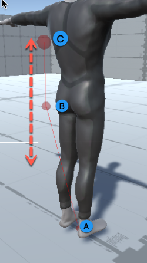

3rdPersonFollow
=

https://docs.unity3d.com/Packages/com.unity.cinemachine@2.9/manual/Cinemachine3rdPersonFollow.html  
适合第三人称的移动方式, 也可以用来做第一人称. 配合 Cinemachine3rdPersonAim 适合射击类游戏  
和目标保持相对固定的位置和距离  
*?? 说了相对位置固定, 为什么还要特意说距离*  
*?? 不选择 aim 算法也会锁定虚相机角度*  
不能直接控制相机, 如果想让相机绕角色移动( alt), 需要通过控制 FollowTarget 来实现  
自带碰撞处理  

* ## 关键点
    * Orgin(A)  
        跟随目标的位置, 就是 vCamera 的 Follow 对象  
        当跟随目标 pivots horizontally 时, rig 也会绕着这个点旋转  
        一般设置在角色的脖子处  
        *?? rig 指什么.*  
        *? target pivots horizontally 可能指角色绕自己的 y 轴旋转, 也就是角色转向*  
        _? 检测碰撞的时候, 相机会被推向这个位置_  

    * Shoulder(B)  
      正常情况下这个点向一侧偏移, 用来制造过肩效果  
      `Vertical rotations of the Follow target are transferred here, so the rig rotates horizontally about the origin, and vertically about the shoulder.`  
      *? vertical rotations 可能指角色拿着枪俯仰*  
      Shoulder 在场景中显示成一个红色小球  
      

    * Hand(C)  
        相对 Shoulder 垂直偏移的位置  
        `Vertically offset in relation to the shoulder. The arm length affects the follow target's screen position when the camera rotates vertically. By default, it is offset from the shoulder, so that vertical rotations will keep the character nicely positioned on the scree`  
        _Hand 是摄像机真正看向的点_  
        _? `vertically offset` 是指相机的 up. Hand 和 Shoulder 的连线总是和 camera 的 forward 垂直_  
          
        _?? 是先确定了相机的角度, 再确定 Hand 的位置的吗_  
        _?? 为什么需要Hand, 直接用 Shoulder 不行吗_  
        _? Hand 总是在屏幕中心, `Vertical Arm Length`可以认为是在屏幕上的垂直偏移, 影响了跟随目标在屏幕上的位置_  
        第一人称把这个值设置为0  
        Hand 在场景中显示成一个红色大球  
        Camera Radius 也会影响 Hand 球的大小  
          

    * Camera(D)  
        相机的角度总是和目标平行, 以 Camera Distance 放在 Hand 的后面  
        *?? 和目标平行是什么意思*  
        *?? Camera Distance 是什么*  
        *?? `后面`是在哪个空间下*  

* ## 关于 Rig 的旋转
    * Shoulder(B) Rotates Horizontally Around Orgin(A)  
        Shoulder(B) 的相对位置是根据 Orgin(A 的位置按 x, y, z 的偏移来的  
        *? rotates 可能并不是指旋转, 只是指在附近*  
        *? horizontally 可能指的是偏移的过程是平直的*  
          

    * Hand(C) Rotates Vertically Around Shoulder(B)  
        Hand(C) 的位置是 Shoulder(B) 的垂直上或者下 Arm Length 距离的位置  
        正值在上面, 负值在下面  
          
      
* ## 属性  
    * Damping  
        相机跟踪目标的反应速度  
        越小反应越快, 越大反应越慢  
        每个轴可以有自己的值  
      
    * Shoulder Offset  
        Shoulder 相对目标 (Orgin) 的偏移  
        这个偏移是在目标空间的  
      
    * Vertical Arm Length  
        Hand 相对 Shoulder 的垂直偏移  
        When The Camera Rotates Vertically, 这个值影响目标在屏幕上的位置  
        *?? 什么是 Rotates Vertically*  
        *?? Shoulder Offset 显然也影响目标在屏幕上的位置, 为什么要特别说明这个*  
      
    * Camera Side  
        Specifies which shoulder the camera is on (left, right, or in-between).  
        *这个值影响的是 ShoulderOffset.x 的实际生效情况. 0表示-ShoulderOffset.x, 1表示ShoulderOffset.x. 不影响yz*  
        *?? 为什么会有 which shoulder 的说法, 并没有看到多个shoulder*  
        *?? Shoulder Offset 还没有决定 side, 这个值是怎么生效的*  
      
    * Camera Distance
        指定 Hand 到 相机的位置  
        即使 Shoulder 的值全是0, 相机也不会和目标重合  
      
    * Camera Collision Filter  
        碰撞检测层  

    * Ignore Tag  
        Tab 忽略  
        主要用来忽略目标  
      
    * Camera Radius  
        相机碰撞半径  
        相机的碰撞大小在相机位置显示成一个黄色的球  
        这个值也会控制 Hand 红球的大小  
        
      
    * Damping Into Collision  
        产生碰撞时, 相机怎么样移出来  
        0是立即, 越大越慢
      
    * Damping From Collision  
        当相机不再碰撞时, 怎么回到正常位置  
        0是立即, 越大越慢  
    