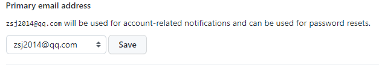

[Setup Git](https://docs.github.com/en/get-started/quickstart/set-up-git)  
==

1. [下载最新 Git]  
   
2. [设置 Git 用户名]  
   用户名在提交时显示, 可以使用任何文本当作用户名  
   改变用户名只会影响新的提交  
   <details><summary>步骤</summary>
   
   1. 打开 Git Bash  
   2. 设置全局用户名  
      ```c#
      $ git config --global user.name "zhangsj"
      ```
   3. 验证  
      ```c#
      $ git config --global user.name
      > zhangsj
      ```

   </details>

      
3. [设置提交邮箱]  
   GitHub 用邮箱关联提交和 GitHub 账号  
   改变邮箱只会影响新的提交  
   <details><summary>步骤</summary>  
   
   1. 在 GitHub 上设置提交邮箱  
      <details><summary>步骤</summary>   

      _在 编辑, 删除, 创建文件, 合并 Pull Request 时可以随时指定邮箱. 
      如果开启了 email address privacy, 邮箱总是`<username>@users.noreply.github.com`_  
      1. 在 GitHub 页面点击头像-settings  
        
      2. 点击 Access - Emails  
        
      3. 点击 "Add email address"  
        
      4. 验证  
      在自动发送的验证右键中点击 "verify email address"  
        
        
      5. 在 "Primary email address 中选择和 web-based Git operations 关联的邮箱"  
        
         
      </details>  
      
   2. 在本地的 Git 中设置提交邮箱         
      <details><summary>步骤</summary>  

      为所有 repository 设置提交邮箱   
      1. 打开 Git Bash  
      2. 设置提交邮箱  
      
      ```c#
      // 确保第一步已经完成, 这个邮箱确实在 github 的账号中
      $ git config --global user.email "zsj@qq.com"
      ```
      3. 验证  
      
      ```c#
      $ git config --global user.email  
      > zsj@qq.com
      ```

      </details>

   </details>

4. [在 Git 中保存 GitHub 邮箱验证]  


[下载最新 Git]:https://git-scm.com/downloads  
[设置 Git 用户名]:https://docs.github.com/en/get-started/getting-started-with-git/setting-your-username-in-git  
[设置提交邮箱]:https://docs.github.com/en/account-and-profile/setting-up-and-managing-your-personal-account-on-github/managing-email-preferences/setting-your-commit-email-address
[在 Git 中保存 GitHub 邮箱验证]:https://docs.github.com/en/get-started/getting-started-with-git/caching-your-github-credentials-in-git  