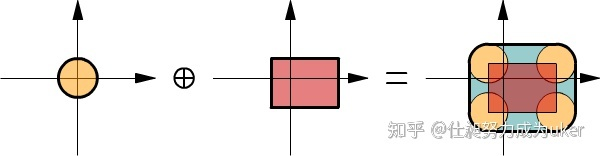

RVO
=
https://www.meltycriss.com/2017/01/13/paper-rvo/  
https://zhuanlan.zhihu.com/p/109556568  
https://gamma.cs.unc.edu/ORCA/publications/ORCA.pdf  

基础知识  
-
+ [Minkowski sum](https://zhuanlan.zhihu.com/p/426717612#ref_2:%7E:text=%E4%B8%AD%E7%9A%84%E5%9F%BA%E7%A1%80%E6%A6%82%E5%BF%B5-,1.1%20Minkowski%20Sum,-%5B2%5D:~:text=%E4%B8%AD%E7%9A%84%E5%9F%BA%E7%A1%80%E6%A6%82%E5%BF%B5-,1.1%20Minkowski%20Sum,-%5B2%5D)  
  A ⊕ B = { a + b | a ∈ A, b ∈ B }  
    

+ [Configuration Space Object](https://zhuanlan.zhihu.com/p/426717612#ref_2:%7E:text=%E4%B8%AD%E7%9A%84%E5%9F%BA%E7%A1%80%E6%A6%82%E5%BF%B5-,1.1%20Minkowski%20Sum,-%5B2%5D:~:text=1.2%20Configuration%20Space%20Object)  
  -B = { -b | b ∈ B }   
  如果 A ⊕ -B 包含原点, 那么两个物体相交  
  
  