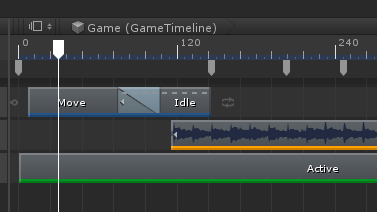
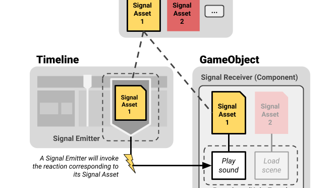
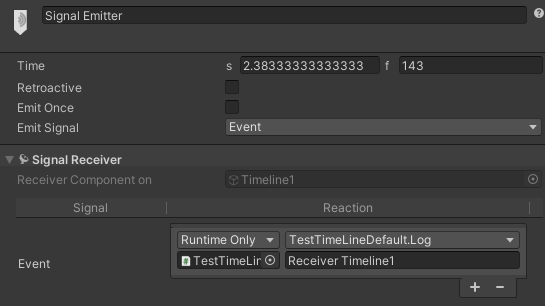
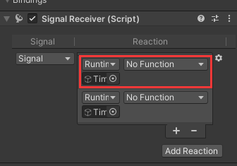

Timeline
=
https://docs.unity.cn/Packages/com.unity.timeline@1.7/manual/index.html  
Track 上的 Clip 是排过序的  

## Signal  
    
  https://blog.unity.com/technology/how-to-use-timeline-signals  
  用来发送事件  
  发送一个事件需要三个点  
    
  1. Signal Asset  
     只单纯表示和同一个 GameObject 的 Receiver 的关联  
     Signal Asset 需要同时关联 Signal Emitter 和 Signal Receiver.  
     可以在不同的 Timeline 实例中重用  
     _?_  
  
  2. Signal Emitter  
     是一个 Marker, 可以放在 Track 上或者时间尺下方的专用的 Marker 上  
     引用 Signal Asset  
     点击 Emitter Inspector 上的 Add Signal Receiver 会自动在 Playable Director 的GameObject 上附加一个脚本 Signal Receiver. 如果指定了 Signal, 也会自动给脚本增加对这个这个 Signal 的 Reaction  
     Emitter 只和同一个 GameObject 下的 Receiver 关联  
     Inspector 下显示的是他关联的, 这个显示只是快捷显示的 Signal Receiver  
       
     
  3. Signal Receiver  
     是一个 MonoBehaviour, 引用 Signal Asset  
     + Reaction  
       指对一个事件的一个处理  
       
  

## [TimelineClip][2]  
  + 注意  
    + 多个动画曲线会同时生效, 应该避免  
    + 如果 Post-Extrapolation 设置为 Hold, 出范围之后会继续调用 OnProcessFrame, 不会调用 OnBehaviourPause. 配合 Director 的 Hold 可以实现永久 Hold.
      但对于动画, 会让动画停在最后一帧.  
    + 如果 Post-Extrapolation 设置为 Continue, 出范围之后, 如果动画设置为循环, 动画会继续正常播放.
      但如果 Director 也 Hold 住了, 动画不会继续循环.  
    
  + 从哪来  
    由 [TrackAsset][3] 产生, 他包装了一个 [PlayableAsset][1]  
    _? 复制没走常规逻辑, 也不会触发构造函数_
    + 在轨道上右键  
    + 拖拽对象到轨道上  
    
  + 作用  
    + 淡入淡出曲线  
    + _??_ 
    
  + 属性  
    + Animation Extrapolation  
        _? 推测效果由轨道的 Mixer 实现_  
        _? 只要 Mixer 创建出来, 就正常处理 Pre/Post-Extrapolation_  
        _? 这个机制没有处理还原坐标. 如果突然停止, 物体会留在当时的位置上, 不管是否是 ApplySceneTransform 模式, 不要指望他去还原位置_  
        动画文件记录了原始坐标  
        + Pre-Extrapolation  
          处于之前的区域时应该怎么生效  
          只有当前一个区域没有被占用时才有效(前面有空位, 并且如果前面有其他 Clip 的话他的 Post-Extrapolation 必须是 None)  
        + Post-Extrapolation  
          处于之后的的区域怎么生效  
  

## 嵌套 Timeline  
  主要用来分工协作  
  https://docs.unity.cn/Packages/com.unity.timeline@1.7/manual/wf_nested.html  
  由 ControlTrack 实现  

## 自定义 Clip  
  https://docs.unity.cn/Packages/com.unity.timeline@1.7/manual/smpl_custom_tween.html?q=CreateTrackMixer  
  自定义 Clip 是指自定义 [PlayableAsset][1]  
  轨道上的元素实际是 [TimelineClip][2]  
  PlayableAsset 不一定要创建一个 Playable, 功能可以只有 Mixer 实现  
  + 自定义长相  
    https://docs.unity.cn/Packages/com.unity.timeline@1.7/manual/smpl_custom_tween.html?q=CreateTrackMixer#4-customize-a-clips-appearance  
    

## 自定义 Track  
  https://docs.unity.cn/Packages/com.unity.timeline@1.7/manual/smpl_custom_tween.html?q=CreateTrackMixer#2-custom-track  
  _?? GatherProperties 是干什么的 _  
  

## 自定义 Marker  
https://docs.unity.cn/Packages/com.unity.timeline@1.7/manual/smpl_custom_annotation.html  
Marker 代表了一个时间点. 是一个 ScriptObject, 内嵌在 Timeline Asset 里.  
像各种 PayableAsset 一样, Maker 也有专门化的功能  
自定义 Maker 继承 Marker 类. 主要提供自定义信息  
对应 Editor 继承自 MarkerEditor. 主要用来控制显示  
重写 [GetMarkerOptions](https://docs.unity.cn/Packages/com.unity.timeline@1.7/api/UnityEditor.Timeline.MarkerEditor.html#UnityEditor_Timeline_MarkerEditor_GetMarkerOptions_UnityEngine_Timeline_IMarker_) 使用数据.  
重写 [DrawOverlay](https://docs.unity.cn/Packages/com.unity.timeline@1.7/api/UnityEditor.Timeline.MarkerEditor.html#UnityEditor_Timeline_MarkerEditor_DrawOverlay_UnityEngine_Timeline_IMarker_UnityEditor_Timeline_MarkerUIStates_UnityEditor_Timeline_MarkerOverlayRegion_) 来修改 Marker 的颜色, 也可以画一条线来垂直穿过整个 Timeline 窗口  
关联标签 [CustomTimelineEditor](https://docs.unity.cn/Packages/com.unity.timeline@1.7/api/UnityEditor.Timeline.CustomTimelineEditorAttribute.html)  
也可以使用 [USS](https://docs.unity.cn/Packages/com.unity.timeline@1.7/manual/uss_styles.html) 控制静态的外观. USS 比 MarkerEditor 先生效  

     
  

Bug
-
  + ExposedReference Serialize Bug  
    https://forum.unity.com/threads/exposed-reference-for-data-in-list.497503/#post-3301741

[1]: https://docs.unity3d.com/ScriptReference/Playables.PlayableAsset.html
[2]: https://docs.unity.cn/Packages/com.unity.timeline@1.7/api/UnityEngine.Timeline.TimelineClip.html
[3]: https://docs.unity.cn/Packages/com.unity.timeline@1.7/api/UnityEngine.Timeline.TrackAsset.html