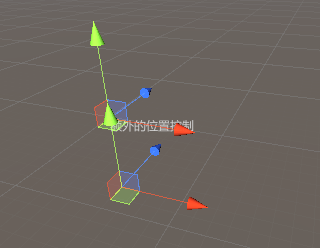

IMGUI Custom Editor
==
为 Component 定制编辑器行为  
1. 替换默认[InspectorGUI](https://docs.unity3d.com/2021.3/Documentation/Manual/UsingTheInspector.html)  
2. SceneGUI  

Custom Editor 脚本继承自 `Editor`  
在这个 Editor 脚本里通过 `CustomEditor` 标签关联到 Component 类型  

`CanEditMultipleObjects` 标签可以标记同时编辑多个 Component 对象  

#### 替换默认 InspectorGUI  
重写 OnInspectorGUI 方法  
```c#
public override void OnInspectorGUI()
{
    serializedObject.Up
    EditorGUILayout.PropertyField(
    serializedObject.ApplyModifiedProper
    if (value.floatValue > 0)
    {
        EditorGUILayout.LabelField("大于0");
    }
}
```

#### SceneGUI  
通过 [Handles](https://docs.unity3d.com/2021.3/Documentation/ScriptReference/Handles.html)
在场景中操作物体

```c#
private void OnSceneGUI()
{
    // 检查是否有改变. 和 Event.Changed 是一个东西, 封装了一下
    EditorGUI.BeginChangeCheck();

    var pos = test.transform.position + Vector3.up;
    
    Handles.Label(pos, "额外的位置控制");
    pos = Handles.PositionHandle(pos, Quaternion.identity);

    // 和 Event.Changed 是一个东西, 封装了以下
    if (EditorGUI.EndChangeCheck())
    {
        // 记录 Undo
        Undo.RecordObject(test, "Move Object");
        test.transform.position = pos;
    }
}
```
  