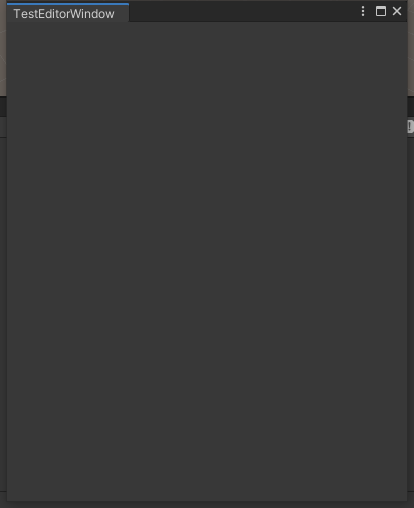

IMGUI Editor Windows
==
创建步骤  
1. 创建脚本继承 [EditorWindow](https://docs.unity3d.com/2021.3/Documentation/ScriptReference/EditorWindow.html)  
2. 让代码来触发窗口显示  
3. 实现窗口内容  

#### Derive From EditorWindow  
脚本必须放在 `Editor` 目录下  
脚本继承 [EditorWindow](https://docs.unity3d.com/2021.3/Documentation/ScriptReference/EditorWindow.html)  
额外的 `EditorGUI` 和 `EditorGUILayout` 方法可以在编辑器中使用. 也可以在非 Window 中使用.  


####  Showing The Window  
可以使用 MenuItem 来显示窗口. MenuItem 是 File Edit Assets 这一样菜单  

通过 `EditorWindow.GetWindow` 创建标准窗口  
```c#
    // 使用 GetWindow 来创建标准窗口
    [MenuItem("Window/TestEditorWindow")]
    public static void ShowWindow()
    {
        // GetWindow 的默认行为是回收窗口, 重复调用这个方法会选择已经存在的
        // 如果窗口已经存在, 不管用哪种方法创建, 总是返回第一个正在显示的窗口, 且传入的参数无效
        // 这个方法会创建一个标准的 dockable editor window
        // ? can be used in custom layouts, 不知道啥意思
        GetWindow<TestEditorWindow>();
    }
```
  

通过 `EditorWindow.GetWindowWithRect` 创建工具窗口  
工具窗口不可停靠
不传参数时行为和 `EditorWindow.GetWindow` 一样  
```c#
GetWindowWithRect<TestEditorWindow>(
    new Rect(Random.Range(0, 100), 
    Random.Range(0, 100), 400, 500), 
    true, 
    "工具窗口");
```
  