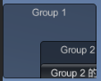
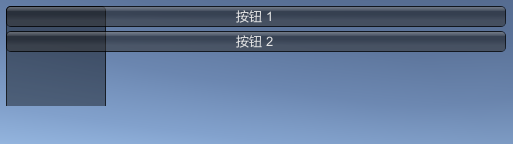
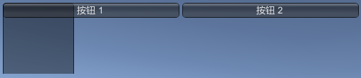
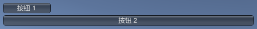

IMGUI Layout Modes  
==

把 GUI 下的方法替换成 GUILayout 就可以使用自动模式  
自动模式不需要 Rect 参数  

可以在一个 OnGUI 方法中同时使用 Fixed 模式和自动模式  
自动模式适合不知道有多少元素, 或者不需要特别手动设置位置时  

Arranging Controls  
--
固定模式: Groups  
自动模式: Areas, Horizontal Groups, Vertical Groups  

#### Groups
GUI.BeginGroup, GUI.EndGroup  
定义一个固定布局区域  
元素的位置相对区域的左上角  
```c#
// Group 范围不影响 GUI.change
// Group 附带 text 等默认显示内容
// Group 会限制内容的显示和交互区域
// Group 也可以嵌套  
var group1Rect = new Rect(0,30, 125, 100);
var group2Rect = new Rect(50, 50, 100, 100);
var buttonRect = new Rect(0, 30, 120, 25);

GUI.BeginGroup(group1Rect);
GUI.Box(new Rect(0, 0, group1Rect.width, group1Rect.height), "Group 1");

GUI.BeginGroup(group2Rect);
GUI.Box(new Rect(0, 0, group2Rect.width, group2Rect.height), "Group 2");
GUI.Button(buttonRect, "Group 2 的按钮");
GUI.EndGroup();

GUI.EndGroup();
```
  

#### Area  
GUILayout.BeginArea, GUILayout.EndArea
定义一个自动布局区域, 布局模式是从上到下  
可视元素的宽度都会拉伸到 Area 的宽度.
可以给元素传 GUILayoutOption 来覆盖自动布局的设置, 比如 `GUILayout.Width(95f)`   
总是需要一个 Area 来进行自动布局  
在自动布局模式下, 不需要为组件指定 rect, 组件会自动放在最 上-左的位置
可以直接在自动布局里适用固定布局元素, 固定布局元素会把 Area 当 Group 使用, 同时不会影响自动布局.  
_? Area 包含 Group 的话, Group 的尺寸(特别是高)怎么指定呢_  
```c#
GUILayout.BeginArea(new Rect(20, 20, 500, 100));

// 固定布局元素被裁剪, 同时也没有影响自动布局
GUI.BeginGroup(new Rect(0, 0, 100, 200));
GUI.Box(new Rect(0, 0, 100, 200), "");
GUI.EndGroup();

// 无法指定 rect, 被拉伸成 Area 的宽度
// ? 按钮的高度是哪来的
GUILayout.Button("按钮 1");
GUILayout.Button("按钮 2");

GUILayout.EndArea();
```
  

#### Horizontal  
GUILayout.BeginHorizontal(), GUILayout,BeginVertical()  
改变 Area 的自动布局模式为从左到右  
Horizontal 里的固定布局元素还是相对 Area  
对子元素的宽度分配未知. 
内部两个按钮会平分. 
内部一个按钮一个 Horizontal, 按钮比例大致在 0.3.  
```c#
GUILayout.BeginArea(new Rect(20, 20, 500, 100));
GUILayout.BeginHorizontal();

// Horizontal 的宽高
GUI.BeginGroup(new Rect(0, 0, 500, 500));
GUI.Box(new Rect(0, 0, 500, 500), "");
GUI.EndGroup();

GUILayout.Button("按钮 1");
GUILayout.Button("按钮 2");
GUILayout.EndHorizontal();

GUILayout.EndArea();
```
  

#### Vertical  
GUILayout.BeginVertical(), GUILayout.EndVertical()  
和 Horizontal 类似  

#### GUILayoutOption  
在自动布局中传 LayoutOption 参数来覆盖自动布局的设置  
[GUILayout.Width](https://docs.unity3d.com/2021.3/Documentation/ScriptReference/GUILayout.Width.html)  
[GUILayout.Height](https://docs.unity3d.com/2021.3/Documentation/ScriptReference/GUILayout.Height.html)  
[GUILayout.MinWidth](https://docs.unity3d.com/2021.3/Documentation/ScriptReference/GUILayout.MinWidth.html)  
[GUILayout.MaxWidth](https://docs.unity3d.com/2021.3/Documentation/ScriptReference/GUILayout.MaxWidth.html)  
[GUILayout.MinHeight](https://docs.unity3d.com/2021.3/Documentation/ScriptReference/GUILayout.MinHeight.html)  
[GUILayout.MaxHeight](https://docs.unity3d.com/2021.3/Documentation/ScriptReference/GUILayout.MaxHeight.html)  
[GUILayout.ExpandWidth](https://docs.unity3d.com/2021.3/Documentation/ScriptReference/GUILayout.ExpandWidth.html)  
[GUILayout.ExpandHeight](https://docs.unity3d.com/2021.3/Documentation/ScriptReference/GUILayout.ExpandHeight.html)  
```c#
// 自动布局元素默认和 Area 一样宽, 手动设置95宽
GUILayout.BeginArea(new Rect(20, 20, 500, 100));
GUILayout.Button("按钮 1", GUILayout.Width(95f));
GUILayout.Button("按钮 2");
GUILayout.EndArea();
```
  