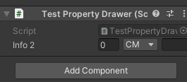
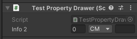

Property Drawers
==
在 Inspector 中自定义外观  
Property Drawers 有两个用处  
1. 自定义 Serializable Class 所有实例的外观  
2. 通过 Property Attributes 自定义 脚本某个序列化成员的外观  

_因为性能原因 EditorGUILayout 不支持在 PropertyDrawer 里用_

#### 共用的 PropertyDrawer
PropertyDrawer 是编辑器脚本  
CustomPropertyDrawer 支持多个
```c#

public enum Unit { CM, M, KM, }

[CustomPropertyDrawer(typeof(Info))]
[CustomPropertyDrawer(typeof(TestAttribute))]
public class InfoDrawer : PropertyDrawer
{
    /// position 是分配的显示区域
    /// label 一般是这个属性的变量名
    public override void OnGUI(Rect position, SerializedProperty property, GUIContent label)
    {
        // 如果是 PropertyAttribute, 可以通过这个获取 attribute 的参数
        var testAttribute = (TestAttribute)attribute;
        
        // Prefab override logic works on the entire property  
        // ? 不知道什么意思. 不是 InspectorName 之类的东西
        // 方法自己的注释是 Create a Property wrapper, useful for making regular GUI controls work with SerializedProperty.
        // 返回 The actual label to use for the control.
        EditorGUI.BeginProperty(position, label, property);
        
        // 还原默认的 Prefix
        // PrefixLabel 的作用是, 他接受分配给一个元素的全部rect, 留出一部分给 label, 返回剩下的 rect 给元素自身. 点击 PrefixLabel 时, 对应元素会获得焦点.
        // EditorGUI.PrefixLabel 第二参数 id 的作用是对应到一个元素, 当 PrefixLabel 被点击的时候, 这个元素可以获得焦点, 当传0的时候会自动对应到下一个元素 
        // 后面实际有三个元素, 不太好对应, 为了保证 PrefixLabel 的焦点功能无效, 传入一个没人用的 id
        position = EditorGUI.PrefixLabel(position, GUIUtility.GetControlID(FocusType.Passive), label);
        
        // indent 会在实际开始元素之前, 留一段空白. 在横排摆这些属性的时候, indent 生效的话会前面会异常留空. 把他临时置0, 保证布局和预想的一样
        // TestPropertyDrawer.info  indent 为 0
        // TestPropertyDrawer.infoList.info 作为数组的元素, indent 为 1
        // indent 的值参照默认 Drawer
        var indent = EditorGUI.indentLevel;
        EditorGUI.indentLevel = 0;
        
        // Caculate rects
        var amountRect = new Rect(position.x, position.y, 30, position.height);
        var unitRect = new Rect(position.x + 35, position.y, 50, position.height);
        var nameRect = new Rect(position.x + 90, position.y, position.width - 90, position.height);
        
        // Darw fields - pass GUIContent.None to ecah so the are draw without labels
        // EditorGUI.PropertyField 默认会显示名字, 传入 GUIContent.none 省略掉. 也可以传入 new GUIContent("123") 来指定
        EditorGUI.PropertyField(amountRect, property.FindPropertyRelative("amount"), GUIContent.none);
        EditorGUI.PropertyField(unitRect, property.FindPropertyRelative("unit"), GUIContent.none);
        EditorGUI.PropertyField(nameRect, property.FindPropertyRelative("name"), GUIContent.none);
        
        // set indent back to what it was
        EditorGUI.indentLevel = indent;
        
        EditorGUI.EndProperty();
    }
}
```

#### 自定义 Serializable Class 外观  
要素: 需要自定义外观的 Serializable 类  
要素: CustomPropertyDrawer 脚本 (链接关系写在这个 Editor 脚本里)  
要素: 显示 Drawer 的地方 - 把类写在 MonoBehaviour 里  
```c#
public class TestPropertyDrawer : MonoBehaviour
{
    public Info info;
    public Info[] infoList;
}

[Serializable]
public class Info
{
    public string name;
    public int amount;
    public Unit unit;
}
```
  

#### 为脚本成员指定外观  
通过 Property Attributes 为指定成员指定外观  
1. 声明一个 `PropertyAttribute`  
2. 在 `PropertyDrawer` 脚本中用 `CustomPropertyDrawer` 把 Drawer 和 Attribute 关联起来  
3. 给想要定义外观的类成员使用这个 PropertyAttribute  
```c#
// // Range 标签就是这种
// [Range(0, 10)]
// public float range;

[Serializable]
public class Info2
{
    public string name;
    public int amount;
    public Unit unit;
}

```
  