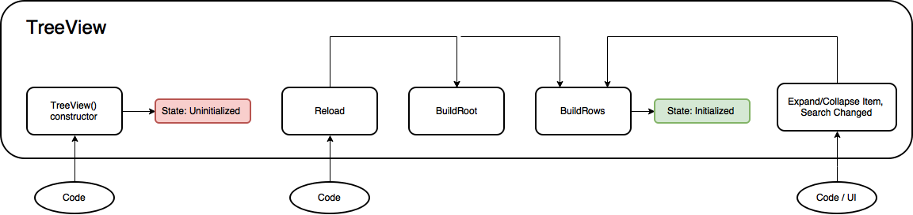

[IMGUI TreeView](https://docs.unity3d.com/2021.3/Documentation/Manual/TreeViewAPI.html)  
==
https://docs.unity3d.com/2021.3/Documentation/ScriptReference/IMGUI.Controls.TreeView.html  
创建脚本继承 TreeView  

### 重要的类  

#### [TreeViewState](https://docs.unity3d.com/2021.3/Documentation/ScriptReference/IMGUI.Controls.TreeViewState.html)  
包含了和 TreeView 在编辑中交互了导致的改变. 
比如 selection state, expanded state, navigation state and scroll state. 
TreeViewState is the only state that is serializable.  
_? 为什么要说 the only state, TreeViewState 包含很多种, 其中一种的名字也叫 TreeViewState 吗_  

在 EditorWindow 中保留 TreeViewState 实例可以防止脚本加载 或者 进入播放模式 导致丢失.  

#### [TreeViewItem](https://docs.unity3d.com/2021.3/Documentation/ScriptReference/IMGUI.Controls.TreeViewItem.html)  
包含 TreeView 中某一行的数据, 用来在 TreeView 中创建对应的结构  
每个 TreeViewItem 有一个唯一的 ID, 用获得对应的 selection state, expanded state and navigation.  
如果这个 Tree 代表 Unity Objects, 可以直接使用 GetInstanceID.  

ID 相同会导致同时选中  

TreeViewItem 的 depth 用来指定显示缩进  

TreeView 有一个 Root TreeViewItem 是隐藏的  

#### [BuildRoot](https://docs.unity3d.com/2021.3/Documentation/ScriptReference/IMGUI.Controls.TreeView.BuildRoot.html)  
BuildRoot 是 TreeView 的 abstract method, 用来创建 Root TreeViewItem  
Root TreeViewItem 的 depth 必须是 -1  

每次 [Reload](https://docs.unity3d.com/2021.3/Documentation/ScriptReference/IMGUI.Controls.TreeView.Reload.html) 时都会调用  
对简单的数据可以直接在这里创建整个 TreeView  
对复杂的在 BuildRows 中创建  
可以通过 `rootItem` 访问  

#### [BuildRows](https://docs.unity3d.com/2021.3/Documentation/ScriptReference/IMGUI.Controls.TreeView.BuildRows.html)  
A virtual method, 用来告诉怎么创建 Rows  
如果没有在 BuildRoot 中创建整个树, 需要在这里实现  

可以通过 `GetRows()` 来访问  

### Tree View Life Time  
  

Reload 触发 BuildRoot  
BuildRoot 触发 BuildRows  

展开收起也会触发 BuildRows  

### 初始化 TreeView  

Reload 调用之后 TreeView 初始化完成  

有两种方式构建 TreeView  
1. 创建整个树  
    通过 BuildRoot 直接创建整个树  
    这是默认和代码最少的方式  
2. 只创建展开的树  
    通过 BuildRows 手动控制 Rows 怎么显示  
    这种方式适合大量数据 或者 频繁变化的  
   
TreeViewItem 有 children, parent, depth 三个基本属性  
正常通过设置这三者可以创建 TreeViewItem  
可以只设置 children 和 parent, 然后通过 [SetupDepthFromParentsAndChildren](https://docs.unity3d.com/2021.3/Documentation/ScriptReference/IMGUI.Controls.TreeView.SetupDepthsFromParentsAndChildren.html) 来创建  
也可以只设置 depth, 然后通过 [SetupParentsAndChildrenFromDepths](https://docs.unity3d.com/2021.3/Documentation/ScriptReference/IMGUI.Controls.TreeView.SetupParentsAndChildrenFromDepths.html) 来创建  

### 示例  

#### 简单 TreeView  
TreeView  
```c#
using System.Collections.Generic;
using UnityEditor.IMGUI.Controls;

public class SimpleTreeView : TreeView
{
    public SimpleTreeView(TreeViewState state) : base(state)
    {
    }

    public SimpleTreeView(TreeViewState state, MultiColumnHeader multiColumnHeader) : base(state, multiColumnHeader)
    {
    }

    protected override TreeViewItem BuildRoot()
    {
        // RootViewItem 的 depth 必须等于 -1, ID 不要求从 0 开始  
        var root = new TreeViewItem() {id = 0, depth = -1, displayName = "Root"};

        #region depth 方式 预览图是这种方式
        
        // 每个 Item 会找理他最近的 depth - 1 的 item 作为 parent. 如果没找到会直接作为 root 的 child, 但保留 depth 的 indent
        // 相同 ID 回到只同时选中
        var allItems = new List<TreeViewItem>
        {
            new TreeViewItem() {id = 1, depth = 0, displayName = "动物"},
            new TreeViewItem() {id = 2, depth = 1, displayName = "野生动物"},
            new TreeViewItem() {id = 3, depth = 1, displayName = "家养动物"},
            new TreeViewItem() {id = 4, depth = 3, displayName = "猪"},
            new TreeViewItem() {id = 5, depth = 3, displayName = "狗"},
        };
        // 根据 depth 自动生成父子关系
        SetupParentsAndChildrenFromDepths(root, allItems);

        #endregion
        

        #region 父子关系方式

        // var animal = new TreeViewItem(1) { displayName = "动物"};
        // var wildAnimal = new TreeViewItem(2) { displayName = "野生动物"};
        // var domesticatedAianimal = new TreeViewItem(3) { displayName = "家养动物"};
        // var pig = new TreeViewItem(4) { displayName = "猪"};
        // var dog = new TreeViewItem(5) { displayName = "狗"};
        //
        // // 注意 root AddChild 
        // root.AddChild(animal);
        // animal.AddChild(wildAnimal);
        // animal.AddChild(domesticatedAianimal);
        // animal.AddChild(pig);
        // animal.AddChild(dog);
        //
        // // 通过这种方式不会出现直接是 root 的 child 但有额外 indent 的情况
        // SetupDepthsFromParentsAndChildren(root);

        #endregion

        return root;
    }
}

```
EditorWindow  
```c#
public class SimpleTreeViewWindow : EditorWindow
{
    // SerializeField 保证只要不关闭窗口, 即使下次登录 state 的信息依然有效  
    // 注意因为需要序列化, 类名和文件名必须一样
    [SerializeField]
    private TreeViewState state;
    private TreeView tree;
    private void OnEnable()
    {
        if (state == null) state = new TreeViewState();

        tree = new SimpleTreeView(state);
        // 需要主动调用 Reload
        tree.Reload();
    }

    private void OnGUI()
    {
        tree.OnGUI(new Rect(0, 0, position.width, position.height));
    }

    [MenuItem("Test/TreeView/SimpleTreeView")]
    public static void ShowWindow()
    {
        GetWindow<SimpleTreeViewWindow>();
    }
}
```
  

#### MultiColumn TreeView

##### [MultiColumnHeader](https://docs.unity3d.com/2021.3/Documentation/ScriptReference/IMGUI.Controls.MultiColumnHeader.html)  
用来创建 MultiColumn TreeView  
控制列是否可拖拽  
提供 Sort 功能  
为每个 Header 提供右键菜单, 并处理  
自定义 Header 的高度  

##### [MultiColumnHeaderState](https://docs.unity3d.com/2023.1/Documentation/ScriptReference/IMGUI.Controls.MultiColumnHeaderState.html)  
记录每一列的状态. 部分数据可序列化.  


