IMGUI
==
https://docs.unity3d.com/cn/current/Manual/GUIScriptingGuide.html  
https://blog.unity.com/technology/going-deep-with-imgui-and-editor-customization  
用来创建游戏内调试显示和工具  
为脚本组件创建自定义组件  
创建新的编辑器窗口和工具  

不适合当作玩家UI  

控件
--
控件声明主要分为三个部分  
* 类型  
  [GUI类型](https://docs.unity3d.com/2021.3/Documentation/ScriptReference/GUI.html)  
  [GUILayout类型](https://docs.unity3d.com/2021.3/Documentation/ScriptReference/GUILayout.html)  
  [部分示例](https://docs.unity3d.com/2021.3/Documentation/Manual/gui-Controls.html)  
* 位置  
  整数的(left-most, top-most, total-width, total-height)  
  单位是像素  
* 内容  
  * 直接传字符串  
    ```c#
    GUI.Box(new Rect(0, 0, 100, 100), "haha");
    ```
    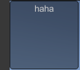  
  * 直接传Texture2D  
    ```c#
    GUI.Box(new Rect(0, 0, 100, 100), icon);
    ```
    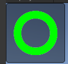
  * 同时传字符串和Texture2D  
    ```c#
    GUI.Box(new Rect(0, 0, 100, 100), new GUIContent("haha",  icon));
    ```
    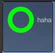  
  * 同时传字符串, Texture2D, tooltip  
    ```c#
    // tooltip 不知道为啥没生效
    GUI.Button(new Rect(0, 0, 100, 100), new GUIContent("haha", icon, "tooltip"));  
    ```
    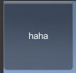  
  


#### [GUI.Box](https://docs.unity3d.com/2021.3/Documentation/ScriptReference/GUI.Box.html)  
创建一个带颜色的盒子  
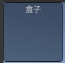

#### [GUI.Label](https://docs.unity3d.com/2021.3/Documentation/ScriptReference/GUI.Label.html)
无交互文本  

#### [GUI.TextField](https://docs.unity3d.com/2021.3/Documentation/ScriptReference/GUI.TextField.html)  
可编辑单行文本  

#### [GUI.TextArea](https://docs.unity3d.com/2021.3/Documentation/ScriptReference/GUI.TextArea.html)  
可编辑多行文本

#### [GUI.Button](https://docs.unity3d.com/2021.3/Documentation/ScriptReference/GUI.Button.html)  
交互按钮, 放开鼠标触发  

#### [GUI.RepeatButton](https://docs.unity3d.com/2021.3/Documentation/ScriptReference/GUI.RepeatButton.html)  
交互按钮, 按住的时候每帧都触发  

#### [GUI.Toggle](https://docs.unity3d.com/2021.3/Documentation/ScriptReference/GUI.Toggle.html)  
切换按钮, CheckBox  
```c#
toggle = GUI.Toggle(new Rect(0, 0, 100, 100), toggle, "Toggle");
```
  

#### [GUI.Toolbar](https://docs.unity3d.com/2021.3/Documentation/ScriptReference/GUI.Toolbar.html)  
多个按钮, 同时只能选中一个  
```c#
// private int selectIndex;
// private string[] buttonNames = { "选项1", "选项2", "选项3" };
selectIndex = GUI.Toolbar(new Rect(0, 0, 200, 100), selectIndex, buttonNames);
```
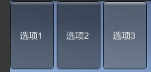  

#### [GUI.SelectionGrid](https://docs.unity3d.com/2021.3/Documentation/ScriptReference/GUI.SelectionGrid.html)  
多行 Toolbar, 同时只能选一个  
```c#
// private int selectIndex;
// private string[] buttonNames = { "选项1", "选项2", "选项3", "选项4" };
selectIndex = GUI.SelectionGrid(new Rect(0, 0, 200, 100), selectIndex, buttonNames, 3);
```
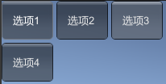  

#### [GUI.HorizontalSlider](https://docs.unity3d.com/2021.3/Documentation/ScriptReference/GUI.HorizontalSlider.html)  
横进度条  
```c#
// 高度貌似无效
// private float value;
value = GUI.HorizontalSlider(new Rect(0, 0, 200, 100), value, 0f, 10f);
```
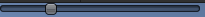  
[GUI.HorizontalScrollbar](https://docs.unity3d.com/2021.3/Documentation/ScriptReference/GUI.HorizontalScrollbar.html)
和他类似, 默认用做 ScrollView 的横滚动条但是多个参数可以控制自己的高度  

#### [GUI.VerticalSlider](https://docs.unity3d.com/2021.3/Documentation/ScriptReference/GUI.VerticalSlider.html)  
竖进度条  
```c#
// 宽度貌似无效
// private float value;
value = GUI.VerticalSlider(new Rect(0, 0, 200, 100), value, 0f, 10f);
```
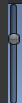  
[GUI.VerticalScrollbar ](https://docs.unity3d.com/2021.3/Documentation/ScriptReference/GUI.VerticalScrollbar.html)
和他类似, 默认用做 ScrollView 的竖滚动条但是多个参数可以控制自己的宽度  

#### [GUI.ScrollView](https://docs.unity3d.com/2021.3/Documentation/ScriptReference/GUI.BeginScrollView.html)  
滚动窗口, 自带两个滚动条. 当实际内容比显示内容大时滚动条自动出现  
额外要素: 分散调用(Begin, End)  
额外要素: 显示尺寸(Rect), 滚动值(Vector2), 内容尺寸(Rect)  
```c#
// 注意滚动条的尺寸也会算到内容区域里(默认横滚动条高16, 竖滚动条宽16)
// 当显示区域和内容区域完全一样大时不会出现滚动条
// 但是如果竖滚动条出现, 会让内容区域变宽, 导致设置为一样宽的显示区域和内容区域也会出现滚动条. 这种情况应该把显示宽度 + 16 才能确保不出现横滚动条
// private string text = "ScrollViews are Controls that display a viewable area of a much larger set of Controls.";
// private Vector2 scrollValue;
// private Rect viewRect = new Rect(0, 0, 100 + 16, 100);
// private Rect contentRect = new Rect(0, 0, 100, 400);
scrollValue = GUI.BeginScrollView(viewRect, scrollValue, contentRect);
text = GUI.TextArea(contentRect, text);
GUI.EndScrollView();
```
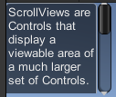  

也可以手动创建滚动条  
[GUI.HorizontalScrollbar](https://docs.unity3d.com/2021.3/Documentation/ScriptReference/GUI.HorizontalScrollbar.html)  
[GUI.VerticalScrollbar ](https://docs.unity3d.com/2021.3/Documentation/ScriptReference/GUI.VerticalScrollbar.html)  

#### [GUI.Window](https://docs.unity3d.com/2021.3/Documentation/ScriptReference/GUI.Window.html)  
Window 可拖动窗口, 通过点击获得焦点  
额外要素: id  
额外要素: WindowFunction   

```c#
// 描述可拖动, 不知道为什么实际不行
// 窗口的范围包括标题
// 不管在什么位置同样的 id 会当作同一个窗口, 最后的那个实际生效  
// 0 不是特殊 id
// 就算没有获得焦点 WindowFunction 也会调用, 不知道焦点的实际作用是什么  
// WindowFunction 中的位置是相对 Window 的位置
// private Rect windowRect = new Rect(0, 0, 200, 150);
// private void WindowFunction(int windowId)
// {
// }
windowRect = GUI.Window(0, windowRect, WindowFunction, "测试窗口");
```
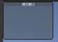  

#### [GUI.changed](https://docs.unity3d.com/2021.3/Documentation/ScriptReference/GUI-changed.html)  
OnGUI 里最开始一定为 false, 内部有改变后为 true  
WindowFunction 里最开始一定为 false, 内部有改变后为 true  
_? 改变不包括宽高这种, 也不包括焦点_  
_? 疑似只关心 GUI方法返回值相对传入值是否改变(在外部取反, 在设置回去不会触发)_
由于只关心 GUI 方法本身的返回一般不用担心多个级别的 GUI 改变引起混乱  


Layout Modes
--
https://docs.unity3d.com/2021.3/Documentation/Manual/gui-Layout.html  


