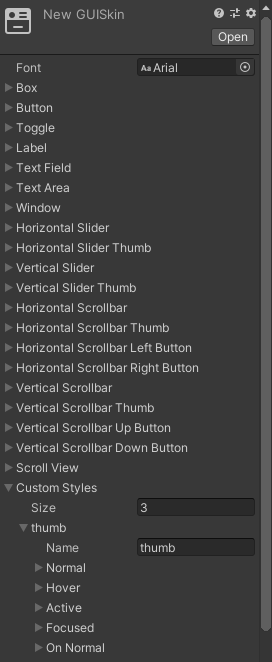

[Going deep with IMGUI and Editor Customization](https://blog.unity.com/technology/going-deep-with-imgui-and-editor-customization)  
==
GUI 的两种模式  
* immediate  
* retained  

immediate 效率低, 太依赖代码对设计师不友好, 但是很适合非实时的情况, 比如编辑器模式.  
_场景GUI和这个类似, 在OnSceneGUI中调用, 方法在 Handles 和 HandleUtility 中. 大体思路和这个类似._
_这两者可以混用, 但需要设置 GL matrices 或者 Handles.BeginGUI 和 Handles.EndGUI 来创建 context._  

### Event  
在 IMGUI 运行的时候, 总有一个 [current Event](https://docs.unity3d.com/ScriptReference/Event-current.html)  
它可能是用户点击了鼠标 或者 GUI 需要 repaint 等, 可以通过 [Event.current.type](https://docs.unity3d.com/ScriptReference/EventType.html) 知道  
只在OnGUI内才有值

### 自定义  
Unity 提供了 [GUI][0] 和 [EditorGUI][1] 两个库.  
注意如果想要相关代码在非编辑器模式生效, 不能使用 [EditorGUI][1]  

自定义自己的控件  
以 Slider 为例, 考虑以下四件事情:  
* 用来显示和相应交互的区域  
* 当前值  
* 外观  
* 返回值  

方法签名
```c#
public static float Slider(Rect position, float value, GUIStyle style)
```

实际实现  
1. 获取 Control ID  
2. 实现主要逻辑  

获取控件ID, 通过它响应鼠标事件  
ID 按照请求顺序分配. 要么不请求, 要么为所有的事件类型请求  
[FocusType][1].Passive 告诉不要响应键盘操作  
```c# 
int controlId = GUIUtility.GetControlID(FocusType.Passive);
```

主要逻辑是处理相应的事件  
<details>
<summary>Slider</summary>

```c#
public static float Slider(Rect position, float value, GUIStyle style)
{
    // id 是按调用顺序分配的
    int controlID = GUIUtility.GetControlID(FocusType.Passive);
    
    // 不直接使用 Event.current.type, 确保事件确实是这个控件的
    EventType eventType = Event.current.GetTypeForControl(controlID);

    switch (eventType)
    {
        case EventType.Repaint:
        {
            // 根据 value 确定宽度
            int pixelWidth = (int)Mathf.Lerp(1f, position.width, value);

            // 填充范围
            Rect targetRect = new Rect(position) { width = pixelWidth};
            
            // 确定颜色
            GUI.color = Color.Lerp(Color.red, Color.green, value);
            
            // 填充
            GUI.DrawTexture(targetRect, style.normal.background);
            
            // 还原颜色
            GUI.color = Color.white;
            
            break;
        }

        case EventType.MouseDown:
        {
            // 如果鼠标左键点击了并且在区域内 告诉 GUI 当前的 hotControl 是自己
            if (Event.current.button == 0 && position.Contains(Event.current.mousePosition))
            {
                GUIUtility.hotControl = controlID;
            }
            
            break;
        }

        case EventType.MouseUp:
        {
            if (Event.current.button == 0 && GUIUtility.hotControl == controlID)
            {
                GUIUtility.hotControl = 0;
            }

            break;
        }
    }
    
    // 通过鼠标的位置确定返回值
    if (
        // 只在鼠标事件中处理. 
        Event.current.isMouse 
        && GUIUtility.hotControl == controlID)
    {
        float relativeX =  Event.current.mousePosition.x - position.x;
        value = Mathf.Clamp01(relativeX / position.width);

        // 标记 GUI changed. 之后 EditorGUI.BeginChangeCheck, EditorGUI.EndChangeCheck() 等之类的衍生方法会调用
        GUI.changed = true;
     
        // 标记当前事件已处理, 防止其他控件处理, 并且触发 repaint
        // Reapint 和 Layout 事件不能标记 Use
        // 注释这句好像也没影响...
        Event.current.Use();
    }
    
    return value;
}
```
</details>

### State of the GUInion  
可以通过 [GUIUtility.GetStateObject] 创建或者获得存储的数据  
这个数据无法序列化, 即使标记了 Serializable  

_? 描述是循环的, 但什么时候销毁呢_

### Doing GUI with Style  
可以通过 GUIStyle 一次性绘制整个组件  
```c#
void Draw(
      Rect position,
      GUIContent content,
      // ? 提供 controlId 的作用是什么
      // 描述是说用来确定控件是否有键盘焦点之类的  
      int controlId,
      bool isHover,
      bool isActive,
      bool on,
      bool hasKeyboardFocus)
```

获得 GUIStyle 的几种方式  
* new GUIStyle() 脚本创建  
* 使用自带的 [EditorStyles]  
* 复制已有然后改变部分属性  
* 从 [GUISkin] 获取  

GUISkin 是一大堆 GUIStyle 对象  
可以作为资源创建, 可以通过 Inspector 修改. 它为大部分标准控件定义了外观.  
在`Custom Styles`中自定外观, 给它一个唯一的 `name`, 之后可以在代码中用 `GUISkin.GetStyle("thumb")` 获得  
GUISkin 本身用 [EditorGUIUtility.LoadRequired] 或者 `AssetDataBase.LoadAssetAtPath` 获得  
  

### Laying Out the Positions  
当调用以下方法时会触发 [EventType.Layout] :  
* [GUILayoutUtility.GetRect]  
* [GUILayout.BeginHorizontal]  
* [GUILayout.EndHorizontal]  
* [GUILayout.BeginVertical]  
* [GUILayout.EndVertical]  

GUILayoutUtility.GetRect 会做两件事情  
* 在 Layout 事件中记录我们想要用一个 style 画一个空内容  
* 获取一个实际的位置给我们使用  

在 Layout 事件中获得 position 其实是假的, 他不会真的用到. 但还是需要做, 这样 GetControlID 不会乱  

[GUILayoutOption] 用来告诉应该用特定的方式来计算位置, 比如:
* 固定 30 的高度 GUILayout.Width(30)  
* 横向扩展  GUILayout.ExpandWidth  
* 至少有 20 的宽 GUILayout.MinWidth(20)  

把这些作为一个数组传给 GUILayoutUtility.GetRect, 
这些信息会存在 layout tree 中, and taken into account when the tree is processed at the end of the layout event  

关键字 `params` 可以用来传递多个参数  
```c#
public static float SliderLayout(float value, GUIStyle style, params GUILayoutOption[] layoutOptions)
{

    // 内置的 GUILayout 版本就是这么做的
    // 这其实也是在通过 GetRect 预留空间, 之后可以自己决定内容怎么分配. 通过这种方式混合自动和固定布局会比全部使用自动布局高效  
    Rect position = GUILayoutUtility.GetRect(GUIContent.none, style, layoutOptions);
    return Slider(position, value, style);
}
```

不要在 PropertyDrawer 中使用自动布局  
> note that if you’re writing PropertyDrawers,
> you should not use the layout system; 
> instead, you should just use the rectangle passed to your PropertyDrawer.OnGUI() override. 
> The reason for this is that under the hood, 
> the Editor class itself does not actually use the layout system, for performance reasons; 
> it just calculates a simple rectangle itself, 
> moving it down for each successive property. 
> So, if you did use the layout system in your PropertyDrawer, 
> it wouldn’t have any knowledge of any of the properties that had been drawn before yours, 
> and would end up positioning you on top of them. 
> Which is not what you want!

### Multi-Property  

#### 支持 SerializedProperty  

SerializedProperty 很重要. 除了告诉你他的值以外, 还会告诉:
* 他和预制上的值有什么不同 
  _? 怎么做_
* 这个值在 inspector 里是展开的还是收拢的  
* Undo and scene dirtying, prefab overrides 等  

使用 SerializedProperty 版本的方法还可以利用 [prefabOverride] 把相对预制修改的属性加粗  
当 [EditorGUI.showMixedValue] 为 true 时, 表示当前正在处理多个对象  

在处理 SerializedProperty 时需要 用 [EditorGUI.BeginProperty] 和 [EditorGUI.EndProperty] 来创建环境  
_怀疑只有修改需要_


[0]:http://docs.unity3d.com/ScriptReference/GUI.html  
[1]:https://docs.unity3d.com/ScriptReference/EditorGUI.html  
[2]:https://docs.unity3d.com/ScriptReference/FocusType.html  
[GUIUtility.GetStateObject]:https://docs.unity3d.com/2023.1/Documentation/ScriptReference/GUIUtility.GetStateObject.html  
[EditorStyles]:https://docs.unity3d.com/ScriptReference/EditorStyles.html  
[GUISkin]:https://docs.unity3d.com/Manual/class-GUISkin.html  
[EditorGUIUtility.LoadRequired]:https://docs.unity3d.com/ScriptReference/EditorGUIUtility.LoadRequired.html  
[AssetDatabase.LoadAssetAtPath]:https://docs.unity3d.com/ScriptReference/AssetDatabase.LoadAssetAtPath.html  
[EventType.Layout]:https://docs.unity3d.com/ScriptReference/EventType.Layout.html  
[GUILayoutUtility.GetRect]:https://docs.unity3d.com/ScriptReference/GUILayoutUtility.GetRect.html  
[GUILayout.BeginHorizontal]:https://docs.unity3d.com/ScriptReference/GUILayout.BeginHorizontal.html  
[GUILayout.EndHorizontal]:https://docs.unity3d.com/ScriptReference/GUILayout.EndHorizontal.html  
[GUILayout.BeginVertical]:https://docs.unity3d.com/ScriptReference/GUILayout.BeginVertical.html  
[GUILayout.EndVertical]:https://docs.unity3d.com/ScriptReference/GUILayout.EndVertical.html  
[GUILayoutOption]:https://docs.unity3d.com/2023.1/Documentation/ScriptReference/GUILayoutOption.html  
[prefabOverride]:https://docs.unity3d.com/ScriptReference/SerializedProperty-prefabOverride.html  
[EditorGUI.showMixedValue]:https://docs.unity3d.com/ScriptReference/EditorGUI-showMixedValue.html  
[EditorGUI.BeginProperty]:https://docs.unity3d.com/ScriptReference/EditorGUI.BeginProperty.html  
[EditorGUI.EndProperty]:https://docs.unity3d.com/ScriptReference/EditorGUI.EndProperty.html  