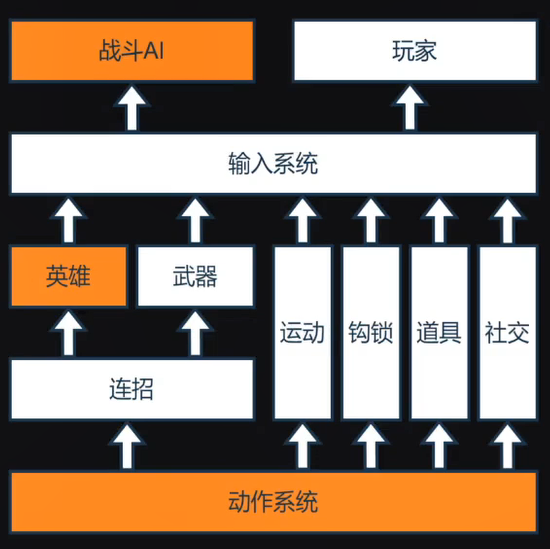
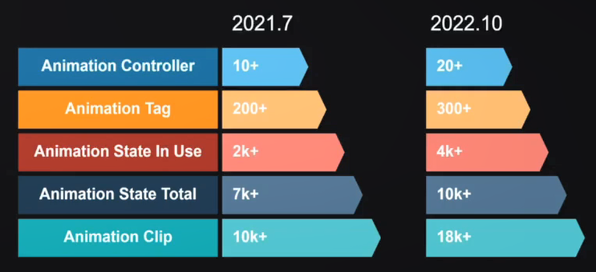
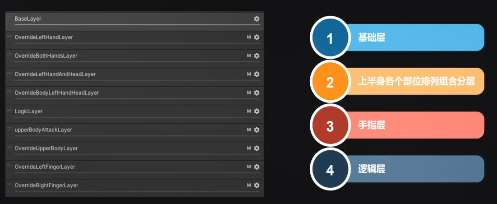

《永劫无间》战斗系统开发经验分享
==
## 战斗系统概述  

  

连招系统建立在动作系统之上  
抽象输入系统, 战斗AI和玩家的输入都在同一个系统内  

## 动作系统  

动作系统是绝大多数战斗机制的驱动载体  

动画资源规模很大, 且增长很快  
Animation Controller 不多 10 -> 20  
Animation Clip 巨多 1w -> 1.8w  
  

动画来源  
- 基础动作  
  慢跑, 快跑, 滑铲, 跳跃, 闪避  
  
- 场景交互动作  
  爬树, 钩锁, 飞檐走壁  
  
- 不同运动状态下的攻击动作  
  原地攻击, 蹲伏攻击, 滑铲攻击, 钩锁攻击, 跳跃攻击  
  
- 每个招式独立配置受击动画  
  希望在任何状态下都可以及时攻击, 并且保证运动表现流畅  
  为了提升表现力, 为不同的招式实现了可配置的受击动画  
  允许策划根据招式打击方向和表现力因素自行配置合适的受击动画  
  最终受击动画是综合运算出来的  
  释放者的: 太刀受击动作, 双截棍受击动作  
  在同一招式下倒地和浮空状态下的受击也是不同的  
  岳山专门的受击动画  
  匕首魂玉亢龙有悔的抱摔也属于受击动画  
  _表现力因素可能是指不同的受击程度_  

动画分层  
10个分层, 大致为 基础层 -> 上半身排列组合 -> 手指层 -> 逻辑层  
基础层  
BaseLayer  
上半身排列组合  
OverrideLeftHandLayer  
OverrideBothHandsLayer  
OverrideLeftHandAndHeadLayer  
OverrideBodyLeftHandHeadLayer  
逻辑层  
LogicLayer  
上半身排列组合  
upperBodyAttackLayer  
手指层  
OverrideUpperBodyLayer  
OverrideLeftFingerLayer  
OverrideRightFingerLayer  

  

_?? 动作指什么, 单纯动画吗_    
_?? 逻辑层是干什么的_  

09:18  

## 技能系统  

## 战斗AI系统  

## 战斗性能优化分享  