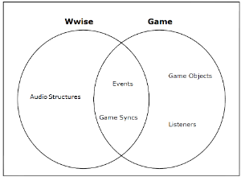

简介
==  

遵循的设计理念:  
- 提供完整的制作解决方案  
- 重新定义音频和震动的制作工作流程  
- 提高管线效率  
- 使用音频和振动扩展游戏沉浸体验  
  _?? 振动 是什么_

音频管线解决方案包括以下部分:  
- 创作应用程序  
  非线性创作工具, 用于创建音频和振动素材结构  
  定义传播, 管理声音、音乐和振动集成, 分析播放性能  
  以及创建 SoundBank  
  _?? 什么是非线性创作工具_  
- 声音引擎  
  用于管理音频和振动处理, 执行全面的多样化功能  
  _?? 游戏的库吗_  
- 游戏模拟器  
  LUA 脚本解释器, 用于准确在线声音和振动在游戏中的运行情况, 能够先验证Wwise在每款频台上的特定行为和分析其性能 
  然后再将Wwise集成到游戏的声音引擎中  
  _?? 独立的模拟器还是类似运行时的性能分析器_  
- 插件式架构  
  可扩展的插件式架构  
  - 用于生成音频和振动的源插件(Source plug-in), 例如 Tone Generator  
  - 创建音频效果的效果器插件(Effect plug-in), 例如混响  
- Wwise 与游戏编辑器之间的接口  
  与外部游戏编辑器之间的专用插件接口  
  使外部应用程序能够无缝的与Wwise通信  
  
重要概念  
  - Audio Structures  
    Created and Managed within the Wwise Application by the sound designer  
  - Events  
    Create the bridge between the audio assets and the game components and are therefore integral to both Wwise and the game
  - Game Syncs  
    Create the bridge between the audio assets and the game components and are therefore integral to both Wwise and the game
  - GameObjects  
    Created and Managed within the game by the programmer  
  - Listeners  
    Created and Managed within the game by the programmer  
    
_?? GameObjects 和 Listeners That emit or receive audio, 他们俩谁发谁听, 还是都负责, 都负责的话有什么区别_  

_?? Bus 是什么_  

  

[Wwise 简介](https://www.audiokinetic.com/zh/library/edge/?source=WwiseFundamentalApproach&id=introducing_wwise_introducing_wwise)  
[Wwise 基本方法](https://www.audiokinetic.com/zh/library/edge/?source=WwiseFundamentalApproach&id=the_wwise_fundamental_approach)  