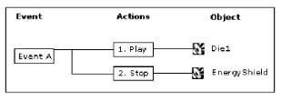
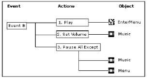
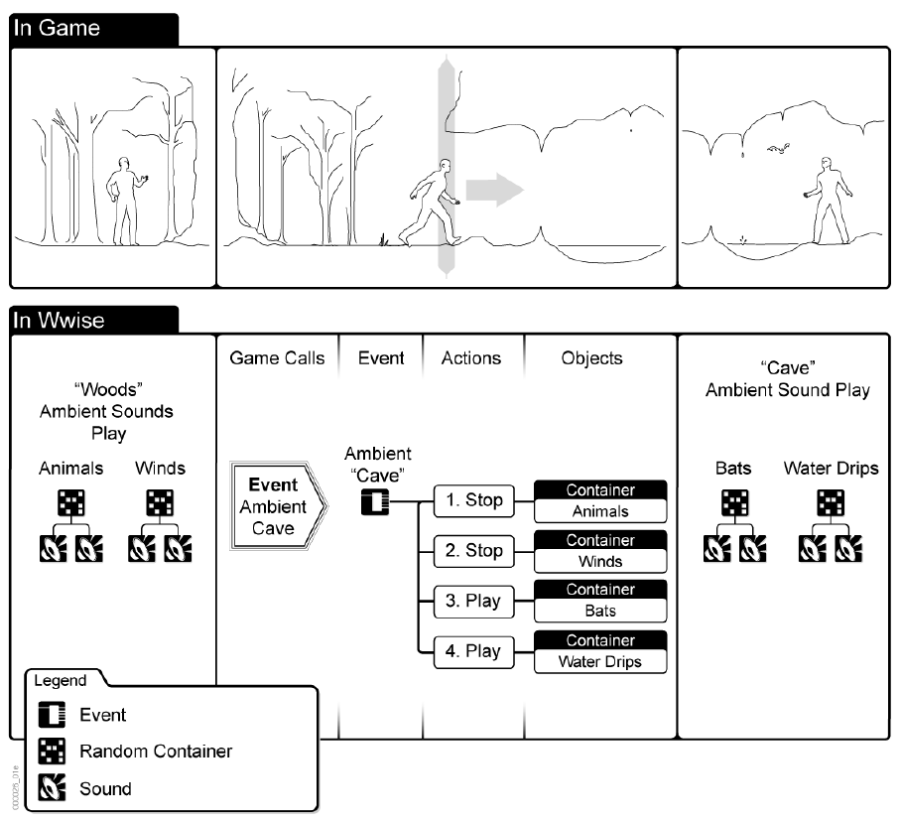
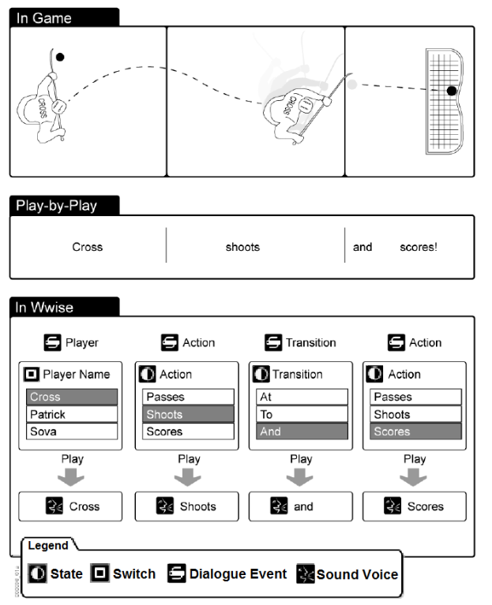
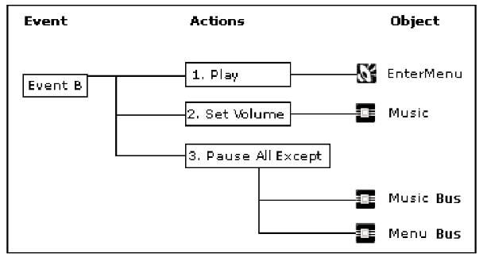

Events
==
> Wwise uses Events to drive th audio in your game.  
These Events apply actions to the different sound objects or object groups.  
The actions you select specify whether the wwise objects will play, stop, and so on.  
For example, let's say you are creating a first-person shooter game and you want to create an Event for when the player dies.  
This Event will play a special “Die” sound and will stop the “EnergyShield” sound that is currently playing.  

Event "A" 把 Action "Play" 应用到 Object "Die1", 把 Action "Stop" 应用到 Object "EnergyShield"  
  

> The sound designer can pick from a long list of action types to drive the audio in game,  
including Mute, Set Volume, Enable Effect Bypass, and so on.  
For example, let's say you created a second Event for when the player leaves the game to enter the menu.  
This Event will play the “Enter_Menu” sound, decrease the volume of the music bus by -10dB, and pause everything else.  

  

> To accommodate as many situations as possible, there are two different types of Events:  
> - "Action" Events  
>    these Events use one or more actions, such as play, stop, pause and so on, to drive the sound, music, and motion in game.  
> - Dialogue Events  
>    these Events use a type of decision tree with States and Switches to dynamically determin what object is played.  

_Action Event 也支持多个 action_  

为了方便应用, 事件分成两种  
Action Events: 直接通过 Action 播放声音  
Dialogue Events: 通过 a type of decision tree With States and Switches 动态决定播什么  

> After Events are created in Wwise, they can be integrated into the game engine  
> so that they are called at appropriate times in the game.  
> Events can be created and integrated into the game early in the development process.  
> You can continue to fine-tune the Event without having to re-integrate it into game engine.  

先在 Wwise 中创建 Events, 然后在游戏中使用  
创建好事件后可以Wwise中微调而不用动游戏  

### Action Events  
> To drive the sound , music, and motion in your game, Wwise uses "action" Events.  
> These Events apply actions to the different structures within your project hierarchy.  
> Each of these Events can contain one action or a series of actions.  
> The actions you select will specify whether the Wwise objects will play, pause, stop, and so on.  

Action Events 可以把多个 Action 应用给 structures, 这个过程在 Project 中完成  
这些 Actions 决定播放, 暂停, 停止等行为  

_? Action Events 可以自定义_  

考虑角色树林走进洞穴  
停止播放树林的声音, 开始播放洞穴的声音  
  

_? 从途中可以看出, 保持的是正在播放的声音包括容器和具体声音, 触发Event没有保留_  

> To deal with the transitions that occur between sound, music, or motion objects,  
> each Event also has a set of parameters that you can use to delay, or fade in and fade out incoming and outgoing objects.  

Event 上可以设置参数来实现延迟播放, 淡入淡出等效果  

### Dialogue Events  
> to drive the dynamic dialogue in your game,  
> Wwise uses the Dialogue Event,  
> Which is basically a set of rules or conditions that determines which piece of dialogue to play.  
> The dialogue Event allows you to re-create a variety of different scenarios,  
> conditions or outcomes that exist in your game.  
> To ensure that you cover every situation, Wwise also allows you to create default or fallback conditions.  

Dialogue Events 能根据条件来决定播什么  
可以有 default or fallback 条件  

_? 可以认为对 Action Event 额外包装了条件_  

> All these conditions are defined using a series of State and Switch values.  
> These State and Switch values are combined to create paths which define the particular conditions or outcomes in the game.  

所有这些条件都是通过 State 和 Switch 定义的, 通过他们来决定最终的 Path.  

_? 条件是用State和Switches定义的, 应该不会直接引用这俩东西, 那 DialogueEvent 是怎么和他们关联的呢_
_?? State 和 Switch 能同时用吗_  
_?? Path 是指 Object 路径吗, 这个路径是自动的还是设计人员定义的, 如果是设计人员定义的, Wwise怎么知道如何对应到最终路径_  

> As the game is played and Dialogue Events are called, 
> the game verifies the existing conditions against those defined in the Dialogue Event. 
> The condition or State/Switch path that matches the current situation in game determines which piece 
> of dialogue is played.  

_?? the game verifies, 由 game 来对比吗, 这个 game 是指游戏逻辑, 还是指游戏中的Wwise引擎_  
_?? the condition or State/Switch path 指什么, State 和 Switch 也是资源吗, 他们有自己的条件吗_  

Dialogue 的本意是处理 game dialogue, 但可以用在其他方面  

> Let's say that you are creating a hockey game with a play-by-play commentary. When a player shoots and scores, you want the play-by-play commentary to correspond to the action in game. To set up the different possibilities and outcomes in Wwise, you will need to create Dialogue Events for Players, Actions, Transitions, and so on. Each of these Events will contain a set of corresponding State and Switch values that you have created for your game. You must create a State/Switch path that defines each condition or outcome and then assign an appropriate voice object to each State/Switch path. During gameplay, the game will match the current State/Switch values against the paths you defined in Wwise to determine which voice object to play.

_?? Cross shoots and scores 顺序是怎么决定, Play-by_Play的固定模式吗, 他们不一定是同时发生的_  
_?? 图中 Players, Actions, Transitions 是不同的 Dialogue Event 吗_  
_?? Dialogue Event 包含 a set of State And Switch, 多个情况的时候怎么生效呢_  
_?? State/Switch Path 指什么, 每个State/Switch自己的Path, 还是指 Player Action Transition Action 这一系列Path_  

  

### Event scope  

> Every action within an Event has a corresponding scope setting. 
> The scope determines whether the Event action is applied globally to all game objects or to the specified game object that triggered the Event. 
> For some actions, the sound designer can choose the scope ,and for other actions, the scope is predetermined.  

Event 的 action 有 scope 概念, 决定 Event action 作用于全局game objects 还是 单独的 game object.  
有些 Action 可以选则 scope, 有些是预定义的(不能改).  

| Event Action | Scope | Comments |
|:---:|:---:|:---:|
| Play > Menu_Enter | Game Object | Scope 是触发的 game object |
| Set Volume > Music | Global | Set Volume 总是作用于 a bus, by its very nature, is Global |
| Pause All Except > Music | Global | Pause All Except 总是作用于 a music bus, by its nature, is Global |

  

_?? Scope 只能是 Global 和 Game Object 吗. 可以对一类 GameObject 生效吗_  

### Integrating Events in to your Game  
> After creating the Events for your game, the sound designer can package them into SoundBank.
> These SoundBanks are then loaded into your game, where the Events can be triggered by game's code.
> For example, when the player is killed, you would play the special "Die" sound, and stop the "EnergyShield" sound by triggering the corresponding event.  

设计人员把Event打包成SoundBank, 在游戏中加载SoundBank, 然后通过代码来触发.  

_?? 一个Bank包括几个Events_  

> To integrate these Event into your game, the programmer must specify onto which game object the Event Actions will be performed. 
> This is done by posting each Events. 
> An Event should be posted by your game's code whenever you want the audio to change.
> You can post events using strings or IDs.  

在代码用的方式 post Events 使用 Events, 同时必须指定 game object. 可以同时使用 string 和 ID.  

_?? 如果 scope 是全局呢_  

### Benefits of Using Wwise Events  
> One main advantage to this method for triggering sound in your game is that 
> it gives the sound designer additional control and flexibility with out requiring any 
> additional programming. 
> All Events are created in Wwise by the sound designer and they are integrated in to the game 
> by the programmer. 
> Once Events are integrated in the game, the sound designer can continue working on them, 
> changing or modifying the actions they contain, or the objects to which they refer. 
> Since your game is still triggering the same Event, the changes made by the sound designer 
> will take effect in the game without requiring extra work from the developer, 
> and without recompiling the code.  

使用事件的好处, 程序只关心触发, 至于播放那种声音放在设计人员一侧, 可以给设计人员更大的自由, 修改的时候程序也不需要重新编译.  

### Setting Properties for an Event Action  
Action 的属性可以指定相关修改的内容  
包括:  
- Delays  
- Transitions  
- Bypass effect properties  
- Volume, Pitch, LPF, Game Parameter, Seek, State, or Switch setting.  

[Setting Properties for an Event Action](https://www.audiokinetic.com/library/edge/?source=Help&id=setting_properties_for_an_event_action)  
[Understanding Events](https://www.audiokinetic.com/library/edge/?source=WwiseFundamentalApproach&id=understanding_events_understanding_events)  
[Concept: Events](https://www.audiokinetic.com/library/edge/?source=SDK&id=concept_events.html)  
