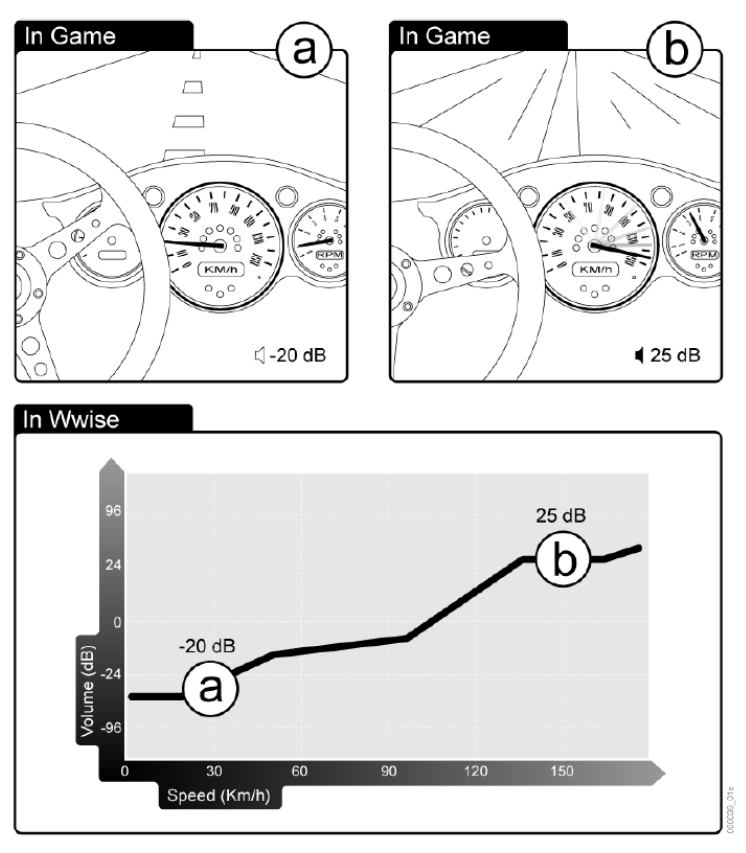

Understanding  RTPCs
==

> Real-time Parameter Controls(RTPCs) enable you to edit specific object properties 
> in real time based on real-time parameter value changes that occur within the game.  

RTPCs 的意思是 实时参数控制(real time parameter control)  

> Using RTPCs, you can map the Game Parameters to property values, 
> and "automate" property changes to enhance the realism of your game.  

通过 RTPCs 可以把 Game Parameters 和 属性关联起来 并且处理属性改变  
_? Game Parameters 指游戏内的参数_  
_? property values 指Wwise object 的属性值_  

> The parameter values are displayed in graph view, where one axis represents either the Switch Group 
> or the property values in Wwise, and the other axis represents the in-Game Parameter values.  

可以把参数用表示为二维坐标轴, 一个轴表示 Switch Group 或者 Wwise object 的属性值, 
另一个轴表示游戏里的参数.  

> By mapping property values to Game Parameter values, you create an RTPC curve 
> that defines the overall relationship between the two parameters. 
> you can create as many curves as necessary to create a rich and immersive experience for the players of you game. 

RTPC curve 定义了游戏参数和Wwise object 属性参数的 overall relationship  
_?? 只能用一一对应关联吗_  

> Let's say you are creating a racing game. 
> The volume and pitch of the engine sounds need to fluctuate as the speed and RPM 
> of the car rise and fall. In this case, you can use RPTCs to map the pitch and 
> volume level of a car's engine sounds to the speed and RPM values of an in-game car. 
> As the car accelerates, the property values for pitch and volume will react based on how you have mapped them. 

可以把车速和引擎音量关联起来  

  