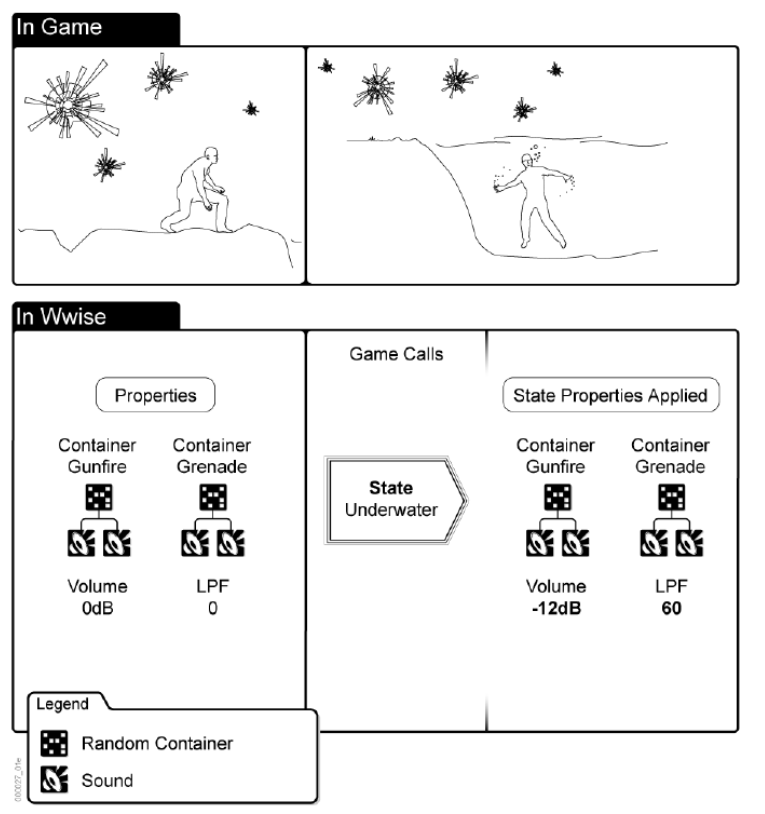
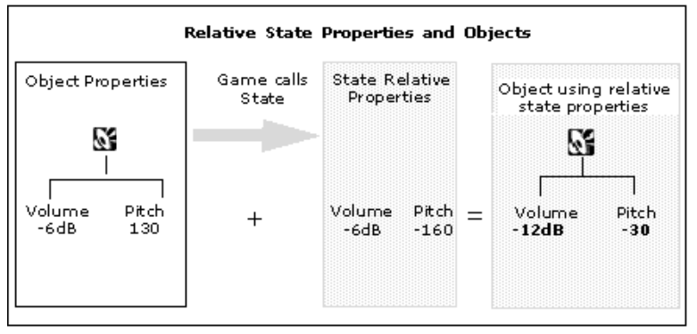

Understanding States
== 
> States are basically "mixer snapshots", or global offsets or adjustments to the game audio
> and motion properties that represent changes in the physical and environmental conditions in the game.

States 仅仅是 "mixer snapshots", global offsets or adjustments to the audio and motion properties.  

_?? State 思路上明显可以作为单个声音的修改, 为什么一直在强调global_  

> Using States can streamline the way you design your audio and motion, and help you optimize your assets.

States 的作用是帮助流水线化设计声音, 优化资源.

> States as "mixer snapshots" allow for level of details and control over the resulting sound output
> and can be combined with multiple States with expected results.

作为 "mixer snapshots" 时, 可以让输出结果有不同级别的细节和控制  
_?? level of details and control 是指哪些方面_

> When an object registers to multiple States, a single property can be affected by multiple value changes.
> In this scenario, each change of values is added up together.  
> For example, when two States in two different State Groups have a volume change of -6dB,
> and both become active simultaneously, the result volume will be -12 dB.

State 需要注册到 object 上, 且同时可以注册多个 State  
同一个object的 多个 State 可以同时叠加生效  
_可以记录相对值_

> When you create and define these "mixer snapshots", you are really creating different  
> property sets for an sound, music, or motion object with out adding to memory or disk space usage.  
> These property sets define a set of rules that govern the playback of a sound during a given State(or States).

创建 States 只会记录改变的属性, 占用很少的内存  
_?? States 也会定义规则吗_

> When you apply these property changes globally to many objects, you can quickly create realistic
> soundscapes that better represent the audio and enhance the game.  
> By altering the properties of sounds, music, or motion already playing, you are
> able to re-use your assets and save memory.

可以认为 States 节省了素材, 或者对声音素材进行了全局的动态调整

> Let's say you want to simulate the sound treatment that occurs when a character goes underwater.
> In this case you could use a State to modify the volume and low pass filter for sounds that are already playing.
> These property changes should create the sound shift needed to recreate how gunfire or
> exploding grenades wound sound when the character is underwater.

_volume -12db, LPF 60 是水下效果_  

### [Understanding How State Properties are Applied to Objects]  

> State properties are always relative. 
> When you apply a State, the effect on the object's properties will be cumulative. 

_State 的属性一般是相对的_  
_? 也就是说可以设置绝对的_  
_?? State Group 是什么, 作用是什么_  

  

[Understanding How State Properties are Applied to Objects]:https://www.audiokinetic.com/library/edge/?source=Help&id=understanding_how_state_properties_are_applied_to_objects  
[Understanding States](https://www.audiokinetic.com/library/edge/?source=WwiseFundamentalApproach&id=understanding_states)  