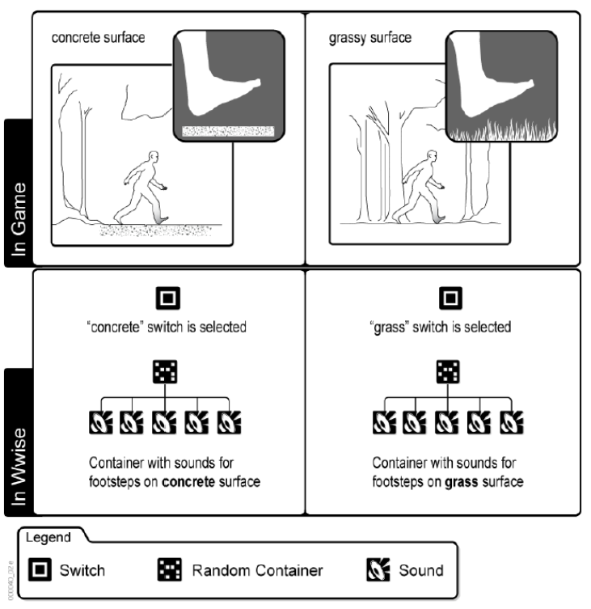

Understanding Switches
==
> In Wwise, Switches represent the different alternatives that exist 
> for a particular game object within the game. 
> Sound, music, and motion objects are organized and assigned to Switches 
> so that the the appropriate sound or motion objet will play when a change is made 
> from one alternative to another in game.  

Switches 代表 alternatives for 一个特定的 game object  
Switches 里放着组织好的声音
当 change 发生时, 播放的声音会从一个 alternative 变成另一个  

_?? 如何组织_  
_?? alternative 的内容是独立的声音还是类似State的修改_  
_?? 对正在播放的声音有效吗, 或者说改变支持播放中改变吗, 还是只是在开始播放的时候判断_  
_? 如果只是在开始的时候判断可能不支持融合_  

> The Wwise objects that are assigned to a Switch are grouped into a Switch Container. 
> When an Event signals a change, the Switch Container verifies the Switch and 
> the correct sound, music, or motion object is played.  

声音是通过 Switch Container 组织在 Switch 里的  
当 Event 触发改变时, Switch Container 会挑选最适合的声音播放  

_?? 挑选声音, 播放声音 这两件事都是由Event在同一个时间点触发的吗_  

> Let's say you are creating a first-person shooter game, 
> where the main character can walk and run through a variety of different environments.  
> Within each environment, you have different ground surfaces, such as a concrete, 
> grass, and dirt, and you want different footstep sounds for each of these surfaces. 
> In this case, you can create Switches for the different ground surfaces and 
> then assign the different footstep sounds to the appropriate Switch. 
> When the main character is walking on a concrete surface, the "concrete" Switch 
> will become active and its corresponding sounds will play.  

角色走在不同的地表发出不同的声音是由Switch实现的  

  

_?? "concrete" Switch 和 "grass Switch" 这是两个Switch还是一个Switches里的_  

[Understanding Switches](https://www.audiokinetic.com/library/edge/?source=WwiseFundamentalApproach&id=understanding_switches)  