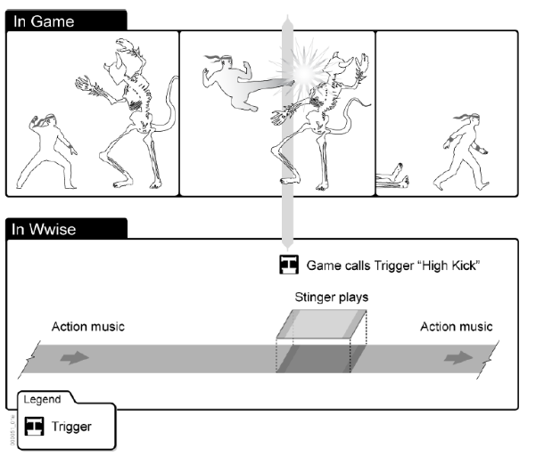

Understanding Triggers
==

> Like all Game Syncs, a Trigger is a Wwise element that is called by the game and 
> then defines a specific response in Wwise to accommodate what is happening in the game. 

跟其他Game Sync一样, Trigger 是由game调用的, 他定义了一个对游戏中事件的回应.  

_? 一个 trigger 对应单个回应_  

> More specifically, in interactive music a trigger responds to a spontaneous occurence in the game 
> and launches a stinger.  
> The stinger, which is a brief musical phrase that is superimposed and mixed over the currently playing music, 
> is a music reaction to the game.  

trigger 会回应游戏中发生的事情, 然后播放一个 stinger  
stinger 是一个music, 会叠加到当前的 music 中播放  

_?? trigger 主动侦听变化, 然后播放 music_  
_?? 在单独说明 music. sound 或者 其他东西不行吗_  

> For example, when a ninja draws his weapon, you might want to insert a musical 
> sforzando-type effect over the action music already playing to add even more impact to the scene. 
> The game would call the trigger which in turn would launch the stinger and you music clip would play over the ongoing score.  

_?? trigger 还是 game call 的 _  

> Let's say that you have created a fighting game 
> where your main character is a ninja fighter. 
> At several points in the game you character goes into action mode
> where he fights his enemies. 
> When your character lands a powerful kick, 
> you want to place a music clip 
> that will intensify the auditory impact of that scene. 
> To build your music for these sequences, 
> you will need create a Trigger, 
> perhaps named "High Kick" to be called at these points in the game. 
> In addition you will define the short music segment 
> that will provide a quick blast of brass to add some "kick".  

  

[Understanding Triggers](https://www.audiokinetic.com/library/edge/?source=WwiseFundamentalApproach&id=understanding_triggers)  